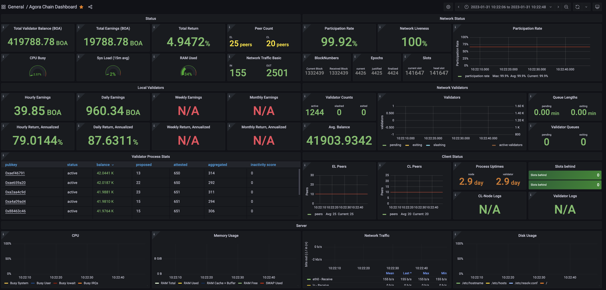

# NHN 클라우드의 Ubuntu 에 BOSagora 노드 설치하기

이 문서는 [NHN 클라우드](https://www.nhncloud.com)의 Ubuntu 서버에 노드를 설치하는 방법이 포함되어 있습니다.

## 1. NHN 클라우드에 가입하기

NHN 클라우드에 가입하는 방법은 유튜브 동영상 [YOUTUBE 1 NHN Cloud 시작하기](https://youtu.be/zkh3VPCfc1E) 에 자세하게 설명되어 있습니다.

## 2. NHN 클라우드에 조직 및 프로젝트 생성하기

NHN 클라우드를 사용하기 위해서는 먼저 조직과 프로젝트를 생성하여야 합니다.
조직과 프로젝트를 생성하는 방법은 유튜브 동영상 [YOUTUBE 2 NHN Cloud Console 시작하기](https://youtu.be/PphP9zBrHeI) 에 자세하게 설명되어 있습니다.

## 3. 서버 (인스턴스) 생성하기

NHN 클라우드에는 4개의 리전에서 서비스 되고 있습니다. 여기서는 비용이 좀 더 저렴한 미국(캘리포니아) 리전을 선택하겠습니다.  
인스턴스를 생성하는 방법은 유튜브 동영상 [YOUTUBE 3 클라우드로 서버 구축하기](https://youtu.be/Ig-DjAj7xcY) 에 자세하게 설명되어 있습니다.

- 조직과 프로젝트를 선택하고 인스턴스 화면으로 이동합니다.
- 리전을 `미국(캘리포니아)` 로 선택합니다.
- `인스턴스 생성` 버턴을 클릭합니다.
- `이미지` 항목에 `Ubuntu Server 20.04 LTS` 를 선택합니다.
- `인스턴스 이름` 항목에 `my-bosagora-validator` 를 입력합니다.
- `인스턴스 타입 선택` 버턴을 클릭하여 `Standard / m2 / m2.c2m4 / 2 / 4GB` 를 선택합니다.
- `키페어 생성` 버턴을 클릭하고, 키페어의 이름을 `my-bosagora-key` 로 입력합니다. 그리고 `다운로드` 버턴을 클릭하여 로컬컴퓨터에 저장합니다.
- `블록 스토리지 타입` 을 `SSD` 로 선택합니다.
- `블록 스토리지 크기` 를 `100GB` 로 선택합니다.
- `플로팅 IP` 항목에서 `설정 변경` 버턴을 클릭하여 `사용` 을 선택합니다.
- `보안 그룹항목` 에서 `설정 변경` 버턴을 클릭하여 숨겨진 화면을 확장합니다.
    - `보안 그룹 생성` 버턴을 클릭합니다.
    - `이름 항목` 에 `bosagora` 를 입력합니다.
    - 하단의 `+` 버턴을 클릭합니다. 방향에는 `수신`, IP 프로토콜에는 `사용자 정의 TCP`, 포트에는 `22`, `CIDR`, `0.0.0.0/0` 을 입력합니다.
    - 하단의 `+` 버턴을 클릭합니다. 방향에는 `수신`, IP 프로토콜에는 `사용자 정의 TCP`, 포트에는 `30303`, `CIDR`, `0.0.0.0/0` 을 입력합니다.
    - 하단의 `+` 버턴을 클릭합니다. 방향에는 `수신`, IP 프로토콜에는 `사용자 정의 UDP`, 포트에는 `30303`, `CIDR`, `0.0.0.0/0` 을 입력합니다.
    - 하단의 `+` 버턴을 클릭합니다. 방향에는 `수신`, IP 프로토콜에는 `사용자 정의 TCP`, 포트에는 `13000`, `CIDR`, `0.0.0.0/0` 을 입력합니다.
    - 하단의 `+` 버턴을 클릭합니다. 방향에는 `수신`, IP 프로토콜에는 `사용자 정의 UDP`, 포트에는 `12000`, `CIDR`, `0.0.0.0/0` 을 입력합니다.
    - 하단의 `+` 버턴을 클릭합니다. 방향에는 `수신`, IP 프로토콜에는 `사용자 정의 TCP`, 포트에는 `3000`, `CIDR`, `0.0.0.0/0` 을 입력합니다.
- `인스턴스 생성` 버턴을 클릭합니다.

## 3. 서버에 접속하기

다양한 OS 에서 서버에 접속하는 방법은 유튜브 동영상 [YOUTUBE 7 인스턴스 접속하기](https://youtu.be/Ig-DjAj7xcY) 에 자세하게 설명되어 있습니다.  
여기에서는 윈도우즈 10 이상에서 접속하는 방법을 설명해 드리겠습니다.

### 3.1. 윈도우즈에서 SSH 클라이언트 설치하기

SSH 클라이언트 구성 요소는 Windows Server 2019 및 Windows 10 디바이스에서 Windows 설정을 사용하여 설치할 수 있습니다.  
OpenSSH 구성 요소를 설치하려면 다음을 수행합니다.   
`설정` 을 열고 `앱` > `앱 및 기능` 을 선택한 다음, `선택적 기능` 을 선택합니다.  
목록을 검색하여 `OpenSSH` 가 이미 설치되어 있는지 확인합니다. 그렇지 않은 경우 페이지 맨 위에서 `기능 추가` 를 선택한 후 다음을 수행합니다.  
`OpenSSH 클라이언트` 를 찾은 다음, 설치 를 클릭합니다.

설정이 완료되고 `앱` > `앱 및 기능 및 선택적 기능` 으로 돌아가면 `OpenSSH` 가 나열됩니다.

`OpenSSH` 을 설치한 후에는 컴퓨터를 재시작 해야 합니다.

### 3.2. 서버에 접속 키페어의 권한 설정하기

서버에 접속하기 위해서는 인스턴스를 생성할 때 받은 키페어가 필요합니다.  
이 키페이어를 C:\bosagora 라는 폴더를 생성한 후 그 곳으로 옮겨 놓습니다.
그리고 그 키페어의 권한 설정이 필요합니다. 아래 명령어를 사용하여 권한을 설정합니다.

- `윈도우즈 명령어 실행창` 을 실행합니다.
- 아래 명령을 키페어가 있는 폴더에서 순서대로 입력합니다.

```shell
cd c:\bosagora

icacls my-bosagora-key.pem /reset
icacls my-bosagora-key.pem /grant:r "%username%:r"
icacls my-bosagora-key.pem /inheritance:r
```

### 3.3. 서버에 접속하기

Instance 화면으로 이동합니다. 접속할 인스턴스를 선택합니다. 하단에 접속정보 탭을 선택합니다.  
아래와 같은 접속명령어가 있습니다. 이것을 복사한 후 `윈도우즈 명령어 실행창` 에서 실행합니다.

```shell
cd c:\bosagora
ssh -i my-bosagora-key.pem ubuntu@your instance IP
```

## 4. 도커 설치하기

아래 명령어를 실행하여 도커를 설치합니다.

사용 가능한 패키지들을 업데이트 합니다.

```shell
sudo apt update
```

도커를 설치합니다.

```shell
sudo apt install docker.io -y
```

도커컴포즈를 설치합니다.

```shell
sudo apt install docker-compose -y
```

사용자가 root 계정외에 다른 계정에서도 도커의 명령어를 사용할 수 있도록 현재 계정을 docker 그룹에 포함합니다.

```shell
sudo /usr/sbin/groupadd -f docker
sudo /usr/sbin/usermod -aG docker 'ubuntu'
sudo chown ubuntu:docker /var/run/docker.sock
```

## 5. 노드설치하기

서버에 터미널로 접속합니다.

아래 명령어를 실행하여 설치파일을 다운로드 합니다.

```shell
wget https://github.com/bosagora/agora-chain/archive/refs/heads/mainnet.zip -O mainnet.zip
```

압축을 해제하기 위해서 먼저 아래 명령어를 실행하여 `unzip` 을 설치해야 합니다.

```shell
sudo apt install unzip
```

아래 명령어를 실행하여 압축을 해제합니다.

```shell
unzip mainnet.zip
```

압축을 해제하면 폴더 `agora-chain-mainnet` 가 생성되고 그 아래에 파일들이 생성됩니다.

아래 명령어를 실행하여 설치된 폴더로 이동합니다.

```shell
cd agora-chain-mainnet
```

## 6. agora-el-node 시작하기

### 6.1. 새로운 터미널로 서버에 접속하기

`윈도우즈 명령어 실행창` 창에 다음과 같이 입력하고 실행합니다.

```shell
cd c:\bosagora
ssh -i my-bosagora-key.pem ubuntu@your instance IP
```

그러면 비밀번호를 입력하고 합니다. 여기에 서버의 접속비밀번호를 입력하면 접속이 완료됩니다.

### 6.2. agora-el-node 를 시작하기

아래 명령어를 실행하여 설치된 폴더로 이동합니다.

```shell
cd agora-chain-mainnet
```

아래 명령어를 실행하여 agora-el 노드의 설정을 초기화 합니다.

```shell
./agora.sh el-node init
```

위 명령어를 실행하면 아래와 같은 로그들이 생성됩니다.

```log
INFO [01-17|05:00:03.938] Maximum peer count                       ETH=50 LES=0 total=50
INFO [01-17|05:00:03.947] Smartcard socket not found, disabling    err="stat /run/pcscd/pcscd.comm: no such file or directory"
WARN [01-17|05:00:03.957] Sanitizing cache to Go's GC limits       provided=1024 updated=645
INFO [01-17|05:00:03.961] Set global gas cap                       cap=50,000,000
INFO [01-17|05:00:03.966] Allocated cache and file handles         database=/root/chain/el/geth/chaindata cache=16.00MiB handles=16
INFO [01-17|05:00:04.001] Opened ancient database                  database=/root/chain/el/geth/chaindata/ancient/chain readonly=false
INFO [01-17|05:00:04.001] Writing custom genesis block 
INFO [01-17|05:00:04.004] Persisted trie from memory database      nodes=1 size=151.00B time=1.530678ms gcnodes=0 gcsize=0.00B gctime=0s livenodes=1 livesize=0.00B
INFO [01-17|05:00:04.005] Successfully wrote genesis state         database=chaindata                     hash=6743c7..cdb71c
INFO [01-17|05:00:04.005] Allocated cache and file handles         database=/root/chain/el/geth/lightchaindata cache=16.00MiB handles=16
INFO [01-17|05:00:04.030] Opened ancient database                  database=/root/chain/el/geth/lightchaindata/ancient/chain readonly=false
INFO [01-17|05:00:04.030] Writing custom genesis block 
INFO [01-17|05:00:04.033] Persisted trie from memory database      nodes=1 size=151.00B time="984.442µs" gcnodes=0 gcsize=0.00B gctime=0s livenodes=1 livesize=0.00B
INFO [01-17|05:00:04.034] Successfully wrote genesis state         database=lightchaindata                     hash=6743c7..cdb71c
```

### 6.3. agora-el-node 를 실행하여 이전에 생성된 블록을 모두 받기

아래 명령어를 실행하여 agora-el-node 를 실행합니다.

```shell
./agora.sh el-node run
```

위 명령어를 실행하면 아래와 같은 로그들이 생성됩니다.

```log
INFO [01-17|05:00:42.211] Starting Agora-el (Agora Execution Layer) client... 
INFO [01-17|05:00:42.212] Bumping default cache on mainnet         provided=1024 updated=4096
INFO [01-17|05:00:42.212] Enabling metrics collection 
INFO [01-17|05:00:42.212] Enabling stand-alone metrics HTTP endpoint address=0.0.0.0:6060
INFO [01-17|05:00:42.212] Starting metrics server                  addr=http://0.0.0.0:6060/debug/metrics
INFO [01-17|05:00:42.216] Maximum peer count                       ETH=50 LES=0 total=50
INFO [01-17|05:00:42.217] Smartcard socket not found, disabling    err="stat /run/pcscd/pcscd.comm: no such file or directory"
WARN [01-17|05:00:42.220] Sanitizing cache to Go GC limits       provided=4096 updated=645
INFO [01-17|05:00:42.220] Set global gas cap                       cap=50,000,000
INFO [01-17|05:00:42.222] Allocated trie memory caches             clean=96.00MiB dirty=161.00MiB
INFO [01-17|05:00:42.222] Allocated cache and file handles         database=/root/chain/el/geth/chaindata cache=321.00MiB handles=524,288
INFO [01-17|05:00:42.249] Opened ancient database                  database=/root/chain/el/geth/chaindata/ancient/chain readonly=false
INFO [01-17|05:00:42.250]  
INFO [01-17|05:00:42.250] --------------------------------------------------------------------------------------------------------------------------------------------------------- 
INFO [01-17|05:00:42.250] Chain ID:  2151 (AGORA MAINNET) 
INFO [01-17|05:00:42.250] Consensus: Beacon (proof-of-stake), merging from Clique (proof-of-authority) 
INFO [01-17|05:00:42.250]  
INFO [01-17|05:00:42.250] Pre-Merge hard forks: 
INFO [01-17|05:00:42.250]  - Homestead:                   0        (https://github.com/ethereum/execution-specs/blob/master/network-upgrades/mainnet-upgrades/homestead.md) 
INFO [01-17|05:00:42.250]  - Tangerine Whistle (EIP 150): 0        (https://github.com/ethereum/execution-specs/blob/master/network-upgrades/mainnet-upgrades/tangerine-whistle.md) 
INFO [01-17|05:00:42.250]  - Spurious Dragon/1 (EIP 155): 0        (https://github.com/ethereum/execution-specs/blob/master/network-upgrades/mainnet-upgrades/spurious-dragon.md) 
INFO [01-17|05:00:42.250]  - Spurious Dragon/2 (EIP 158): 0        (https://github.com/ethereum/execution-specs/blob/master/network-upgrades/mainnet-upgrades/spurious-dragon.md) 
INFO [01-17|05:00:42.250]  - Byzantium:                   0        (https://github.com/ethereum/execution-specs/blob/master/network-upgrades/mainnet-upgrades/byzantium.md) 
INFO [01-17|05:00:42.250]  - Constantinople:              0        (https://github.com/ethereum/execution-specs/blob/master/network-upgrades/mainnet-upgrades/constantinople.md) 
INFO [01-17|05:00:42.250]  - Petersburg:                  0        (https://github.com/ethereum/execution-specs/blob/master/network-upgrades/mainnet-upgrades/petersburg.md) 
INFO [01-17|05:00:42.250]  - Istanbul:                    0        (https://github.com/ethereum/execution-specs/blob/master/network-upgrades/mainnet-upgrades/istanbul.md) 
INFO [01-17|05:00:42.251]  - Berlin:                      0        (https://github.com/ethereum/execution-specs/blob/master/network-upgrades/mainnet-upgrades/berlin.md) 
INFO [01-17|05:00:42.251]  - London:                      0        (https://github.com/ethereum/execution-specs/blob/master/network-upgrades/mainnet-upgrades/london.md) 
INFO [01-17|05:00:42.251]  - Arrow Glacier:               0        (https://github.com/ethereum/execution-specs/blob/master/network-upgrades/mainnet-upgrades/arrow-glacier.md) 
INFO [01-17|05:00:42.251]  - Gray Glacier:                0        (https://github.com/ethereum/execution-specs/blob/master/network-upgrades/mainnet-upgrades/gray-glacier.md) 
INFO [01-17|05:00:42.251]  
INFO [01-17|05:00:42.251] Merge configured: 
INFO [01-17|05:00:42.251]  - Hard-fork specification:    https://github.com/ethereum/execution-specs/blob/master/network-upgrades/mainnet-upgrades/paris.md 
INFO [01-17|05:00:42.251]  - Network known to be merged: false 
INFO [01-17|05:00:42.251]  - Total terminal difficulty:  2411764 
INFO [01-17|05:00:42.251]  - Merge netsplit block:       1375549  
INFO [01-17|05:00:42.251] --------------------------------------------------------------------------------------------------------------------------------------------------------- 
INFO [01-17|05:00:42.251]  
INFO [01-17|05:00:42.251] Initialising Ethereum protocol           network=2151 dbversion=<nil>
INFO [01-17|05:00:42.252] Loaded most recent local header          number=0 hash=6743c7..cdb71c td=1 age=53y9mo3w
INFO [01-17|05:00:42.252] Loaded most recent local full block      number=0 hash=6743c7..cdb71c td=1 age=53y9mo3w
INFO [01-17|05:00:42.252] Loaded most recent local fast block      number=0 hash=6743c7..cdb71c td=1 age=53y9mo3w
WARN [01-17|05:00:42.253] Failed to load snapshot, regenerating    err="missing or corrupted snapshot"
INFO [01-17|05:00:42.253] Rebuilding state snapshot 
INFO [01-17|05:00:42.253] Resuming state snapshot generation       root=b30ae1..8127f9 accounts=0 slots=0 storage=0.00B dangling=0 elapsed="480.848µs"
INFO [01-17|05:00:42.253] Generated state snapshot                 accounts=1 slots=0 storage=50.00B dangling=0 elapsed="819.538µs"
INFO [01-17|05:00:42.254] Regenerated local transaction journal    transactions=0 accounts=0
WARN [01-17|05:00:42.254] Chain pre-merge, sync via PoW (ensure beacon client is ready) 
INFO [01-17|05:00:42.254] Gasprice oracle is ignoring threshold set threshold=2
INFO [01-17|05:00:42.255] Stored checkpoint snapshot to disk       number=0 hash=6743c7..cdb71c
WARN [01-17|05:00:42.255] Error reading unclean shutdown markers   error="leveldb: not found"
WARN [01-17|05:00:42.255] Engine API enabled                       protocol=eth
INFO [01-17|05:00:42.256] Starting peer-to-peer node               instance=Geth/v1.10.23-stable/linux-amd64/go1.18.7
INFO [01-17|05:00:42.266] New local node record                    seq=1,673,931,642,265 id=8cd9239cc44ee0ed ip=127.0.0.1 udp=30303 tcp=30303
INFO [01-17|05:00:42.270] IPC endpoint opened                      url=/root/chain/el/geth.ipc
INFO [01-17|05:00:42.271] Generated JWT secret                     path=/root/chain/el/geth/jwtsecret
INFO [01-17|05:00:42.271] Started P2P networking                   self=enode://8420e0c5414b2f055506e94d0df24644c43096d80f081fd0f2cc4f9f4e506093846bc39132cc390cf8af1a0bf493b3c9bb21ef7ad7f785a665badef939ef5fd4@127.0.0.1:30303
INFO [01-17|05:00:42.272] HTTP server started                      endpoint=[::]:8545 auth=false prefix= cors= vhosts=*
INFO [01-17|05:00:42.274] WebSocket enabled                        url=ws://127.0.0.1:8551
INFO [01-17|05:00:42.274] HTTP server started                      endpoint=127.0.0.1:8551 auth=true  prefix= cors=localhost vhosts=localhost
INFO [01-17|05:00:42.796] Block synchronisation started 
INFO [01-17|05:00:42.836] Downloader queue stats                   receiptTasks=0 blockTasks=0 itemSize=650.00B throttle=8192
ERROR[01-17|05:00:42.965] Pending request exists for joining peer  peer=188b153e
INFO [01-17|05:00:42.985] Imported new chain segment               blocks=384 txs=0 mgas=0.000 elapsed=143.857ms   mgasps=0.000 number=384 hash=f41394..43db99 age=6mo3w23h dirty=0.00B
INFO [01-17|05:00:43.261] Imported new chain segment               blocks=192 txs=0 mgas=0.000 elapsed=88.534ms    mgasps=0.000 number=576 hash=6d5aec..a45043 age=6mo3w23h dirty=0.00B
INFO [01-17|05:00:43.447] New local node record                    seq=1,673,931,642,266 id=8cd9239cc44ee0ed ip=54.169.250.225 udp=30303 tcp=30303
INFO [01-17|05:00:44.125] Imported new chain segment               blocks=2048 txs=0 mgas=0.000 elapsed=851.476ms   mgasps=0.000 number=2624 hash=7c4bec..deafcf age=6mo3w15h dirty=0.00B
INFO [01-17|05:00:44.737] Imported new chain segment               blocks=2048 txs=0 mgas=0.000 elapsed=593.371ms   mgasps=0.000 number=4672 hash=aa3153..b98a55 age=6mo3w7h  dirty=0.00B
INFO [01-17|05:00:45.415] Imported new chain segment               blocks=2048 txs=0 mgas=0.000 elapsed=651.075ms   mgasps=0.000 number=6720 hash=150c46..9a3526 age=6mo2w6d  dirty=0.00B
INFO [01-17|05:00:46.080] Imported new chain segment               blocks=2048 txs=0 mgas=0.000 elapsed=645.732ms   mgasps=0.000 number=8768 hash=8b0d1f..80c2d0 age=6mo2w6d  dirty=0.00B
INFO [01-17|05:00:46.661] Imported new chain segment               blocks=2048 txs=0 mgas=0.000 elapsed=552.193ms   mgasps=0.000 number=10816 hash=f8383b..8e1d36 age=6mo2w6d  dirty=0.00B
...
...
...
INFO [01-17|05:08:23.927] Imported new chain segment               blocks=2048 txs=0    mgas=0.000   elapsed=995.844ms   mgasps=0.000  number=1,245,760 hash=2f6948..824352 age=4h52m26s  dirty=2.71MiB
INFO [01-17|05:08:24.575] Imported new chain segment               blocks=1251 txs=8    mgas=0.945   elapsed=636.772ms   mgasps=1.485  number=1,247,011 hash=e40b3c..bb6021 dirty=2.72MiB
INFO [01-17|05:08:25.305] Imported new chain segment               blocks=2    txs=0    mgas=0.000   elapsed=1.522ms     mgasps=0.000  number=1,247,013 hash=1291f0..cf6ccf dirty=2.72MiB
INFO [01-17|05:08:33.160] Imported new chain segment               blocks=1    txs=0    mgas=0.000   elapsed="829.446µs" mgasps=0.000  number=1,247,014 hash=aa3419..6daab6 dirty=2.72MiB
```

위 명령어를 실행하면 이전 블록들을 수신합니다. 로그 내용 중에서 `age` 가 점점 작아지고 있는 것을 확인할 수 있습니다.   
로그의 내용중에서 블록번호(number)를 http://boascan.io 에서 확인한 가장최근의 블록번호와 동일하면 과거데이타가 모두 수신된 것입니다.  
또한 마직막 라인처럼 임포트된 블록의 갯수가 1이면 모두 수신된 것입니다.

## 7. agora-cl-node 시작하기

이전에 실행한 agora-el-node 는 종료하지 마시고, 서버에 새로운 터미널로 접속합니다.

### 7.1. 새로운 터미널 접속하기

`윈도우즈 명령어 실행창` 창에 다음과 같이 입력하고 실행합니다.

```shell
cd c:\bosagora
ssh -i my-bosagora-key.pem ubuntu@your instance IP
```

그러면 비밀번호를 입력하고 합니다. 여기에 서버의 접속비밀번호를 입력하면 접속이 완료됩니다.

### 7.2. agora-cl-node 를 실행하여 이전에 생성된 블록을 모두 받기

아래 명령어를 실행하여 설치된 폴더로 이동합니다.

```shell
cd agora-chain-mainnet
```

아래 명령어를 실행하여 agora-cl-node 를 실행합니다.

```shell
./agora.sh cl-node run
```

위 명령어를 실행하면 아래와 같은 로그들이 생성됩니다.

```log
Unable to find image 'bosagora/agora-cl-node:v1.0.3' locally
v1.0.3: Pulling from bosagora/agora-cl-node
b49b96595fd4: Already exists 
9411f38bb959: Already exists 
39621572cdf6: Already exists 
c5a366754cd7: Already exists 
7c3f66696336: Pull complete 
3c2cba919283: Pull complete 
Digest: sha256:a5bdb94a63d4f5071316f54121976fdf7e03c1f7dfd077e5dd197c7d2d357365
Status: Downloaded newer image for bosagora/agora-cl-node:v1.0.3

Terms of Use

By downloading, accessing or using the Agora-cl implementation (“Agora-cl”), you (referenced herein
as “you” or the “user”) certify that you have read and agreed to the terms and conditions below.

TERMS AND CONDITIONS: https://github.com/bosagora/agora-cl/blob/agora/TERMS_OF_SERVICE.md


Type "accept" to accept this terms and conditions [accept/decline]: (default: decline):
accept
```

여기에 `accept`를 입력합니다.

```log
[2023-01-17 09:12:34]  WARN flags: Running Agora-cl (Agora Consensus Layer) client using chain configuration yaml file
[2023-01-17 09:12:34]  WARN node: Agora-cl configured for AGORA MAINNET
[2023-01-17 09:12:34]  INFO node: Checking DB database-path=/root/chain/cl/beaconchaindata
[2023-01-17 09:12:34]  INFO db: Opening Bolt DB at /root/chain/cl/beaconchaindata/beaconchain.db
[2023-01-17 09:12:34]  INFO node: Deposit contract: 0xc26dd0f6e94afe288a2dd5d300f4ddaa0d93d9cb
[2023-01-17 09:12:34]  INFO p2p: Running node with peer id of 16Uiu2HAmHXUd8aMCphUHFVqAq6GiSMgiRpiJPHEE523pUdXtVyDj 
[2023-01-17 09:12:34]  INFO rpc: gRPC server listening on port address=0.0.0.0:4000
[2023-01-17 09:12:34]  INFO rpc: You are using an insecure gRPC server. This is expected when running your beacon node and validator on the same machine as recommended.
[2023-01-17 09:12:34]  INFO node: Starting beacon node version=Prysm/Unknown/e2340867bda56a483e858711d6fd0d2a79af8e37. Built at: 2022-11-22 23:56:48+00:00
[2023-01-17 09:12:34]  INFO initial-sync: Waiting for state to be initialized
[2023-01-17 09:12:34]  INFO blockchain: Waiting to reach the validator deposit threshold to start the beacon chain...
[2023-01-17 09:12:34]  INFO gateway: Starting API middleware
[2023-01-17 09:12:34]  INFO gateway: Starting gRPC gateway address=0.0.0.0:3500
[2023-01-17 09:12:49]  INFO powchain: Connected to new endpoint: /***
[2023-01-17 09:15:20] ERROR powchain: Unable to process past deposit contract logs, perhaps your execution client is not fully synced error=no contract code at given address
[2023-01-17 09:16:22]  WARN powchain: Execution client is not syncing
[2023-01-17 09:16:22] ERROR powchain: could not get eth1 block hash: could not query header with height 724481: not found
[2023-01-17 09:16:32]  WARN powchain: Execution client is not syncing
[2023-01-17 09:16:32]  INFO powchain: Falling back to historical headers and logs sync. Current difference is 448
[2023-01-17 09:16:46]  WARN powchain: Execution client is not syncing
[2023-01-17 09:16:46]  INFO powchain: Falling back to historical headers and logs sync. Current difference is 47172
[2023-01-17 09:17:56]  INFO powchain: Currently waiting for chainstart Additional validators needed=1023 Generating genesis state in=1506h44m29s
[2023-01-17 09:17:56]  WARN powchain: Execution client is not syncing
[2023-01-17 09:17:56]  INFO powchain: Falling back to historical headers and logs sync. Current difference is 98540
```

오랜 시간이 걸린후 아래와 같은 로그가 출력됩니다.

```log
[2023-01-18 06:58:41]  INFO initial-sync: Starting initial chain sync...
[2023-01-18 06:58:41]  INFO initial-sync: Waiting for enough suitable peers before syncing required=3 suitable=0
[2023-01-18 06:58:41]  INFO p2p: Started discovery v5 ENR=enr:-MK4QH8beJU0lWG4lU3IUijLM4jVCRHwKZ9qNmmwgdh3t5HZZazlndZIldm9GLO6WPdopDlK5MuyzxeCGdS0CyEoeHOGAYXDrDT3h2F0dG5ldHOIAAAAAAAAAACEZXRoMpCfk-OaLxoCAJwYAAAAAAAAgmlkgnY0gmlwhA3U1TGJc2VjcDI1NmsxoQNiEe83U3MX6Z0b0vxit39llPEWEY1NNmKZeI61bpbQsYhzeW5jbmV0cwCDdGNwgjLIg3VkcIIu4A
[2023-01-18 06:58:41]  INFO p2p: Node started p2p server multiAddr=/ip4/172.17.0.3/tcp/13000/p2p/16Uiu2HAmKFpAbk14ua3xS2xe3sHiDsmVgWYCtNPpXsHLrJKLUJkg
[2023-01-18 06:58:41]  INFO p2p: Node started external p2p server multiAddr=/ip4/13.212.213.49/tcp/13000/p2p/16Uiu2HAmKFpAbk14ua3xS2xe3sHiDsmVgWYCtNPpXsHLrJKLUJkg
[2023-01-18 06:58:46]  INFO initial-sync: Processing block batch of size 31 starting from  0x663d83fe... 49665/49732 - estimated time remaining 43s blocksPerSecond=1.6 peers=10
[2023-01-18 06:58:47]  INFO initial-sync: Processing block batch of size 37 starting from  0x07483e92... 49696/49732 - estimated time remaining 10s blocksPerSecond=3.4 peers=10
[2023-01-18 06:58:47]  INFO initial-sync: Synced to finalized epoch - now syncing blocks up to current head currentSlot=49732 syncedSlot=49732
[2023-01-18 06:58:47]  INFO initial-sync: Synced up to slot 49732
[2023-01-18 06:58:47]  INFO sync: Subscribed to topic topic=/eth2/9f93e39a/beacon_block/ssz_snappy
[2023-01-18 06:58:47]  INFO sync: Subscribed to topic topic=/eth2/9f93e39a/beacon_aggregate_and_proof/ssz_snappy
[2023-01-18 06:58:47]  INFO sync: Subscribed to topic topic=/eth2/9f93e39a/voluntary_exit/ssz_snappy
[2023-01-18 06:58:47]  INFO sync: Subscribed to topic topic=/eth2/9f93e39a/proposer_slashing/ssz_snappy
[2023-01-18 06:58:47]  INFO sync: Subscribed to topic topic=/eth2/9f93e39a/attester_slashing/ssz_snappy
[2023-01-18 06:58:47]  INFO sync: Subscribed to topic topic=/eth2/9f93e39a/sync_committee_contribution_and_proof/ssz_snappy
[2023-01-18 06:58:53]  INFO blockchain: Synced new block block=0x7b407a3b... epoch=1554 finalizedEpoch=1552 finalizedRoot=0x708ea5b4... slot=49733
[2023-01-18 06:58:53]  INFO blockchain: Finished applying state transition attestations=1 slot=49733 syncBitsCount=511
[2023-01-18 06:58:56]  INFO powchain: Connected to new endpoint: /***
[2023-01-18 06:59:05]  INFO blockchain: Synced new block block=0x98df813e... epoch=1554 finalizedEpoch=1552 finalizedRoot=0x708ea5b4... slot=49734
[2023-01-18 06:59:05]  INFO blockchain: Finished applying state transition attestations=1 slot=49734 syncBitsCount=511
[2023-01-18 06:59:17]  INFO blockchain: Synced new block block=0x83334714... epoch=1554 finalizedEpoch=1552 finalizedRoot=0x708ea5b4... slot=49735
[2023-01-18 06:59:17]  INFO blockchain: Finished applying state transition attestations=1 slot=49735 syncBitsCount=511
[2023-01-18 06:59:29]  INFO blockchain: Synced new block block=0x01c0949d... epoch=1554 finalizedEpoch=1552 finalizedRoot=0x708ea5b4... slot=49736
[2023-01-18 06:59:29]  INFO blockchain: Finished applying state transition attestations=1 slot=49736 syncBitsCount=511
[2023-01-18 06:59:41]  INFO p2p: Peer summary activePeers=24 inbound=4 outbound=20
[2023-01-18 06:59:41]  INFO blockchain: Synced new block block=0x3e900abf... epoch=1554 finalizedEpoch=1552 finalizedRoot=0x708ea5b4... slot=49737
[2023-01-18 06:59:41]  INFO blockchain: Finished applying state transition attestations=1 slot=49737 syncBitsCount=511
[2023-01-18 06:59:53]  INFO blockchain: Synced new block block=0x9c28db03... epoch=1554 finalizedEpoch=1552 finalizedRoot=0x708ea5b4... slot=49738
[2023-01-18 06:59:53]  INFO blockchain: Finished applying state transition attestations=1 slot=49738 syncBitsCount=511
```

로그의 내용중에서 slot 이 http://agorascan.io 에서 확인한 가장 최근의 slot 과 동일하면 과거데이타가 모두 수신된 것입니다.

## 8. agora-cl-validator 시작하기

### 8.1. 새로운 터미널로 서버에 접속하기

`윈도우즈 명령어 실행창` 창에 다음과 같이 입력하고 실행합니다.

```shell
cd c:\bosagora
ssh -i my-bosagora-key.pem ubuntu@your instance IP
```

그러면 비밀번호를 입력하고 합니다. 여기에 서버의 접속비밀번호를 입력하면 접속이 완료됩니다.

```shell
cd agora-chain-mainnet
```

### 8.2. 검증자의 키를 임포트하기

하나의 서버에는 여러개의 검증자키를 임포트할 수 있습니다.  
검증자의 키는 사용자가 키생성 프로그램으로 생성하여야 합니다.  
검증자키는 검증자 프로그램이 다른 검증자가 제시한 블록에 서명을 할 때 사용됩니다.  
검증자키의 파일이름은 다음과 같은 형태로 되어 있습니다. #는 임의의 숫자입니다.

```text
keystore-m_12381_3600_0_0_0-##########.json
```

검증자키를 임포트하면 root/wallet 이라는 폴더가 생성됩니다. 이곳에 여러개의 검증자키가 하나의 파일로 저장됩니다.  
또한 wallet 에 접근하기 위해서는 비밀번호를 입력하여야 합니다.  
최초 검증자키를 임포트할 때 wallet 은 자동으로 생성됩니다. 이때 wallet 의 비밀번호를 입력합니다.  
따라서 당신은 검증자키의 비밀번호와 wallet 의 비밀번호 가 다르게 존재할 수 있다는 것을 이해해야 합니다.

#### 8.2.1. 검증자키를 서버에 전송하기

서버로 파일을 전송하는 방법은 다양합니다.  
여기서는 내컴퓨터의 파일의 내용을 복사한 후, 서버에 파일을 생성하여 붙여넣는 방법을 사용해 보겠습니다.

아래 명령어를 사용하여 폴더 root 아래에 mykeys 라는 이름의 폴더를 생성합니다.

```shell
mkdir root/mykeys
```

아래 명령어를 사용하여 폴더 root/mykeys 아래에 파일 key1.json을 생성하고 편집기를 실행합니다.

```shell
nano root/mykeys/key1.json
```

- **nono 편집기의 명령어의 단축키는 다음과 같습니다.**

| 단축키    | 동작                                               |
|--------|--------------------------------------------------|
| ctrl+g | 도움말 표시                                           |
| ctrl+x | nano 종료 (혹은 현재의 file buffer를 닫음)                 |
| ctrl+o | 현재 편집 중인 파일 저장                                   |
| ctrl+j | 문단을 justify(행의 끝을 나란히 맞추다)한다. 즉, 한 문단을 한 줄로 붙인다. |
| ctrl+r | 현재 file에 다른 file의 내용을 추가한다.                      |
| ctrl+k | 현재의 line 혹은 선택된 text 삭제(그리고 저장(copy))            |
| ctrl+u | 붙여넣기 (paste)                                     |

내 컴퓨터의 검증자키 파일 중 하나를 선택하여 텍스트 편집기로 읽어옵니다.  
그리고 그 내용을 복사해서 터미널에 붙여 넣습니다.  
내 컴퓨터의 검증자키 파일은 다음과 같은 형태로 되어 있습니다. #는 임의의 숫자입니다.

```text
keystore-m_12381_3600_0_0_0-##########.json
```

이제 root/mykeys/key1.json 에는 내컴퓨터에서 생성한 검증자키 파일의 내용이 복사되었습니다.  
ctrl+o를 눌러 저장합니다. 그러면 파일이름이 보여주고 저장할지 취소할 지 물어봅니다. 이때 엔터키를 눌러저장을 합니다.  
그리고 ctrl+x를 눌러서 편집기를 종료합니다.

#### 8.2.2. 검증자키를 임포트하기

아래 명령어를 실행하면 폴더 root/mykeys 내부의 모든 검증자키 들이 wallet 으로 임포트됩니다.

```shell
./agora.sh validator accounts import mykeys
```

```log
Unable to find image 'bosagora/agora-cl-validator:v1.0.3' locally
v1.0.3: Pulling from bosagora/agora-cl-validator
b49b96595fd4: Already exists 
9411f38bb959: Already exists 
39621572cdf6: Already exists 
c5a366754cd7: Already exists 
e4f0a6926093: Pull complete 
3c2cba919283: Pull complete 
Digest: sha256:997571c68b44aded52c10915fa9b0b96fca3391d71f5bfcf7ab6b6635b189976
Status: Downloaded newer image for bosagora/agora-cl-validator:v1.0.3

Terms of Use

By downloading, accessing or using the Agora-cl implementation (“Agora-cl”), you (referenced herein
as “you” or the “user”) certify that you have read and agreed to the terms and conditions below.

TERMS AND CONDITIONS: https://github.com/bosagora/agora-cl/blob/agora/TERMS_OF_SERVICE.md


Type "accept" to accept this terms and conditions [accept/decline]: (default: decline):
```

`accept`를 입력합니다.

```log
[2023-01-17 08:46:28]  WARN flags: Running Agora-cl (Agora Consensus Layer) client using chain configuration yaml file
Password requirements: at least 8 characters
New wallet password: 
```

최초 실행시에는 wallet 이 존재하기 않았기 때문에 wallet 을 생성하기 위한 비밀번호를 입력합니다.

```log
Confirm password: 
```

위와 같은 내용이 출력됩니다. 이 때 다시 한번 더 똑같이 비밀번호를 입력합니다.

```log
[2023-01-17 08:48:26]  INFO accounts: Successfully created new wallet wallet-path=/root/wallet
[2023-01-17 08:48:26]  INFO validator: You are using an insecure gRPC connection. This is expected when running your beacon node and validator on the same machine as recommended.
Enter the password for your imported accounts: 
```

위와 같은 내용은 출력되면 이제 임포트할 검증자키의 비밀번호를 입력하면 됩니다.

```log
Importing accounts, this may take a while...
Importing accounts... 100% [==========================================]  [1s:0s]
Successfully imported 1 accounts, view all of them by running `accounts list`
```

그러면 폴더내부의 모든 키가 임포트됩니다.

```text
Importing accounts, this may take a while...
[2023-01-17 08:53:06]  WARN accounts: Could not import keystore for 9475fc6d96c368c2efcbc4337e40fd28231dfda319016dc96a6604c716501cf2aefb2f73b5b58261f49d25ee4a035bea: incorrect password for key 0x9475fc6d96c368c2efcbc4337e40fd28231dfda319016dc96a6604c716501cf2aefb2f73b5b58261f49d25ee4a035bea
Successfully imported 1 accounts, view all of them by running `accounts list`
```

만약 위와 같은 내용일 출력되면 해당 검증자키가 비밀번호를 잘 못 입력하여 임포트할 수 없다는 내용입니다.  
검증자키가 여러개 있을 때, 모두 비밀번호가 같지 않을 수 있기 때문에 개별적으로 메세지가 출력됩니다.

이제 임포트가 완료되었습니다.

#### 8.2.3. 임포트된 검증자키의 리스트를 출력하기

검증자키가 정상적으로 임포트되었지 다시 한 번 더 확인하기 위해 다음 명령어를 실행해서 확인합니다.

```shell
./agora.sh validator accounts list
```

다음과 같은 내용이 출력됩니다. 이 과정에 accept 와 wallet 의 비밀번호를 입력하여야 합니다.  
그러면 임포트된 검증자의 공개키들이 출력됩니다.

```log
Terms of Use

By downloading, accessing or using the Agora-cl implementation (“Agora-cl”), you (referenced herein
as “you” or the “user”) certify that you have read and agreed to the terms and conditions below.

TERMS AND CONDITIONS: https://github.com/bosagora/agora-cl/blob/agora/TERMS_OF_SERVICE.md


Type "accept" to accept this terms and conditions [accept/decline]: (default: decline):
accept
[2023-01-17 08:57:11]  WARN flags: Running Agora-cl (Agora Consensus Layer) client using chain configuration yaml file
Wallet password: 
[2023-01-17 08:57:17]  INFO validator: You are using an insecure gRPC connection. This is expected when running your beacon node and validator on the same machine as recommended.
(keymanager kind) local wallet

Showing 1 validator account
View the eth1 deposit transaction data for your accounts by running `validator accounts list --show-deposit-data`

Account 0 | namely-secure-katydid
[validating public key] 0x9475fc6d96c368c2efcbc4337e40fd28231dfda319016dc96a6604c716501cf2aefb2f73b5b58261f49d25ee4a035bea
```

### 8.3. 월렛의 비밀번호가 기록된 텍스트 생성

검증자 프로그램이 실행되기 위해서는 wallet 의 검증자키를 읽어와야 합니다.  
그러나 wallet 의 비밀번호는 사용자만 알고 있고, 프로그램은 알 수 없기 때문에 매번실행될 때 마다 물어봅니다.  
이것은 보안적으로 우수하나 프로그램을 백그라운드로 실행하기에는 해결하기 어려운 점이 있습니다.  
따라서 비밀번호를 텍스트로 기록하여 검증자프로그램에게 알려주어야 합니다.

다음 명령어를 사용하여 자동 및 백그라운드 실행을 위한 비밀번호를 입력합니다.  
기본값은 password 로 되어 있습니다. 이것을 wallet 의 비밀번호로 변경해 주십시오

```shell
nano root/config/cl/password.txt
```

nano 편집기의 명령어는 이전과 동일합니다. ctrl+o -> Enter : 저장, ctrl+x : 종료

### 8.4. 수수료 입금계좌 등록

2023년 2월 9일 부터 검증자가 블록을 제안하는 기능이 추가됩니다.  
보스아고라 네트워크는 검증자가 제안한 블록에 포함된 트랜잭션 수수료를 검증자에게 지급합니다.  
이 보상을 받기 위해서는 입금계좌를 등록하여야 합니다.  
입급계좌의 정보는 검증자 마다 다르게 설정할 수 있습니다. 여기서는 편의상 하나의 주소로 지급하는 것으로 설정하겠습니다.  
관련 문서는 이 [링크](https://agora-cl-docs.bosagora.org/docs/execution-node/fee-recipient) 를 참조해주십시오

다음 명령어를 실행해서 수수료 입금계좌를 수정합니다.

```shell
nano root/config/cl/proposer_config.json
```

그러면 다음과 같은 내용이 이미 있을 것입니다.

```json
{
  "proposer_config": {
    "0x000000000000000000000000000000000000000000000000000000000000000000000000000000000000000000000000": {   
      "fee_recipient": "0x0000000000000000000000000000000000000000"
    }
  },
  "default_config": {
    "fee_recipient": "0x0000000000000000000000000000000000000000"
  }
}
```

아래와 같이 수정하면 됩니다. fee_recipient 에는 사용자의 메타마스크 주소를 입력하면 됩니다.

```json
{
  "proposer_config": {
  },
  "default_config": {
    "fee_recipient": "0xD85864db188F0425556139872c764c4Ee64dE3B3"
  }
}
```

nano 편집기의 명령어는 이전과 동일합니다. ctrl+o -> Enter : 저장, ctrl+x : 종료

### 8.5. 검증자 프로그램 실행하기

agora-el-node 와 agora-cl-node 의 과거 블록데이타를 모두 수신한 후 agora-el-node 와 agora-cl-node 가 실행 중 일때 다음 명령어를 실행해서 검증자 프로그램을 실행합니다.

```shell
./agora.sh validator run
```

그러면 다음과 같은 로그가 출력됩니다.

```log
[2023-01-18 07:01:51]  WARN flags: Running Agora-cl (Agora Consensus Layer) client using chain configuration yaml file
[2023-01-18 07:01:51]  INFO node: Opened validator wallet keymanager-kind=direct wallet=/root/wallet/direct
[2023-01-18 07:01:51]  WARN node: Slashing protection file /root/chain/cl/validator.db is missing.
If you changed your --wallet-dir or --datadir, please copy your previous "validator.db" file into your current --datadir.
Disregard this warning if this is the first time you are running this set of keys.
[2023-01-18 07:01:51]  INFO node: Checking DB databasePath=/root/chain/cl/
Adding optimizations for validator slashing protection 100% [===================================================================================================================]  [0s:0s]
[2023-01-18 07:01:51]  INFO validator: You are using an insecure gRPC connection. This is expected when running your beacon node and validator on the same machine as recommended.
[2023-01-18 07:01:51]  INFO node: Starting validator node version=Prysm/Unknown/e2340867bda56a483e858711d6fd0d2a79af8e37. Built at: 2022-11-23 00:07:41+00:00
[2023-01-18 07:01:51]  INFO validator: Syncing with beacon node to align on chain genesis info
[2023-01-18 07:01:51]  INFO validator: Beacon chain started genesisTime=2023-01-11 09:12:17 +0000 UTC
[2023-01-18 07:01:51]  INFO validator: Validating for public key publicKey=0x9475fc6d96c3
[2023-01-18 07:01:51]  INFO validator: Waiting for deposit to be observed by beacon node pubKey=0x9475fc6d96c3 status=UNKNOWN_STATUS
```

40,000 BOA 를 예치한 후 12시간이 지난 검증자들은 그 상태가 활성화(Active) 되고, 검증자로서의 역할을 수행합니다.  
만약 예치한 후 12시간안에 검증자 클라이언가 시작되지 않으면 페널티를 받아 BOA 의 잔고가 감소합니다.  
따라서 노드설치와 운영에 대한 충분한 지식을 습득한 후 40,000 BOA 를 예치하시기 바랍니다.

## 9. docker-compose 를 사용하여 백그라운드로 실행하기

지금까지 시작된 agora-el-node, agora-cl-node, agora-cl-validator 는 서버와의 접속이 종료되면 프로세스도 종료됩니다.  
따라서, 이들 프로세스가 백그라운드 상태로 실행되도록 하여야 합니다.  
이것을 쉽게 할 수 있는 방법이 docker-compose 를 사용하는 방법입니다.

먼저 agora-el-node, agora-cl-node 의 과거 블록데이터의 동기화가 완료되었는지 확인합니다.  
모든 블록의 동기화가 완료된 경우 agora-cl-validator, agora-cl-node, agora-el-node 순으로 ctrl+c를 눌러 프로세스를 종료합니다.

아래 명령어를 실행하면 3개의 프로세스가 백그라운드로 실행됩니다.

```shell
./agora.sh docker-compose up                                                                                     
```

그러면 다음과 같은 로그가 출력됩니다.

```log
Creating network "agora-chain-mainnet_default" with the default driver
Creating agora-el-node ... done
Creating agora-cl-node ... done
Creating agora-cl-validator ... done
```

프로세스를 종료하는 명령어 다음과 같습니다.

```shell
./agora.sh docker-compose down
```

노드들의 실행 상태를 보기 위해서는 docker 명령어를 이용하여 로그를 확인하면 됩니다.

아래 명령어를 실행하면 agora-el-node 의 로그를 확인할 수 있습니다. 종료할 때는 ctrl+c를 입력하면 됩니다.

```shell
docker logs -f agora-el-node
```

아래 명령어를 실행하면 agora-cl-node 의 로그를 확인할 수 있습니다. 종료할 때는 ctrl+c를 입력하면 됩니다.

```shell
docker logs -f agora-cl-node
```

아래 명령어를 실행하면 agora-cl-validator 의 로그를 확인할 수 있습니다. 종료할 때는 ctrl+c를 입력하면 됩니다.

```shell
docker logs -f agora-cl-validator
```

## 10. docker-compose 를 사용하여 모니터링 하기

### 10.1. 새로운 터미널 접속하기

`윈도우즈 명령어 실행창` 창에 다음과 같이 입력하고 실행합니다.

```shell
cd c:\bosagora
ssh -i my-bosagora-key.pem ubuntu@your instance IP
```

그러면 비밀번호를 입력하고 합니다. 여기에 서버의 접속비밀번호를 입력하면 접속이 완료됩니다.

### 10.2. 모니터링 기능이 내장된 도커컴포즈 실행하기 를 시작하기



아래 명령어를 실행하여 설치된 폴더로 이동합니다.

```shell
cd agora-chain-mainnet
```

기존의 프로세스를 모두 종료합니다.

```shell
./agora.sh docker-compose down
```

모니터링 기능이 내장된 도커컴포즈를 실행합니다.

```shell
./agora.sh docker-compose-monitoring up
```

프로세스를 종료하는 명령어 다음과 같습니다.

```shell
./agora.sh docker-compose-monitoring down
```

### 10.3. Grafana 설정하기

웹 브라우즈에 다음과 같은 주소를 입력합니다.

```text
http://[서버의 IP]:3000
```

서버의 IP는 서버정보에서 찾을 수 있습니다.

최초 로그인 아이디는 `admin` 이고, 비밀번호는 `admin` 입니다.  
로그인 하면 비밀번호를 변경하는 화면이 나옵니다. 이때 새로운 비밀번호를 입력하면 비밀번호가 변경됩니다.

### 10.4. Grafana 데이타소스 추가하기

좌측 메뉴에서 하단의 기어모양의 아이콘을 클릭하면 메뉴창이 나타납니다.

- 메뉴창에서 `Data sources` 를 선택합니다.
- 그러면 Data source 를 추가할 수 있는 화면으로 전환됩니다.
- 화면 중앙의 `Add data source` 버턴을 클릭합니다.
- `Prometheus` 를 선택합니다.
- `URL` 항목에 `http://prometheus:9090` 을 입력합니다.
- `Scrape interval` 항목에 `60s` 을 입력합니다.
- 화면 하단의 `Save & test` 버턴을 클릭합니다.

모든 과정이 잘 설정되었면 `Data source is working` 라는 팝업메세지가 표시됩니다.

### 10.5. Grafana Dashboard 추가하기

왼쪽 메뉴의 위에서 네번째 아이콘을 클릭하면 `Dashboards` 리는 메뉴가 나타납니다. 메뉴창에서 `+ import` 를 선택합니다.  
아래 URL 의 내용을 복사합니다.

https://raw.githubusercontent.com/bosagora/agora-chain/mainnet/monitoring/dashboard/agora-chain-dashboard.json

복사한 내용을 `Dashboards / Import dashboard` 화면의 `Import via panel json` 입력창에 붙여넣습니다.  
그러면 새로운 Dashboard 가 추가되고 화면에 나타납니다.  
각 항목좌측 상단에 i 라는 곳에 마우스를 오버하면 간단한 설명을 보여줍니다.

## 11. 노드실행 스크립트와 설정들을 업그레이드하기

지금 사용하고 계신 스크립트와 노드실행에 필요한 설정파일들은 지속적을 업그레이드 될 수 있습니다.  
따라서 사용자는 노드 프로그램과 설정들의 업그레이드 상태를 주기적으로 확인하셔야 합니다.

다음과 같은 명령어를 실행하여 업그레이드 합니다.

```shell
/bin/bash -c "$(curl -fsSL https://raw.githubusercontent.com/bosagora/agora-chain/mainnet/upgrade.sh)"
```
